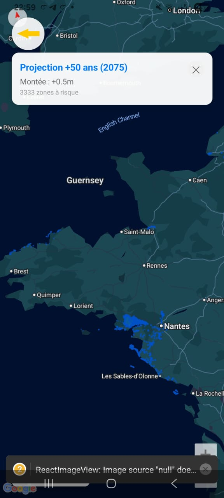
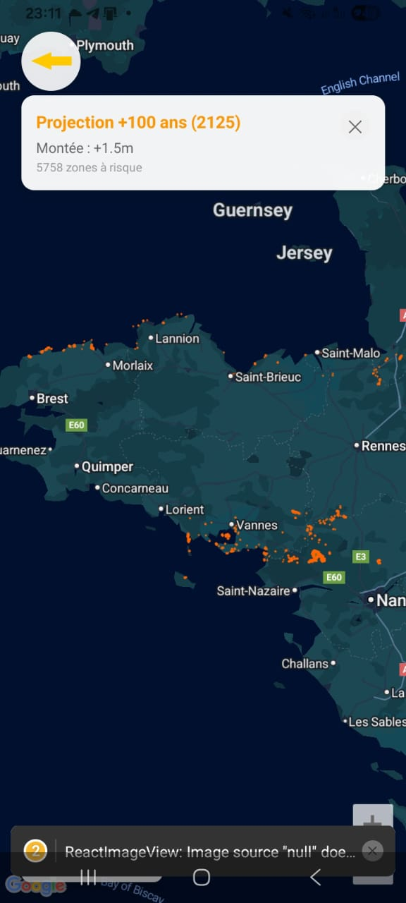
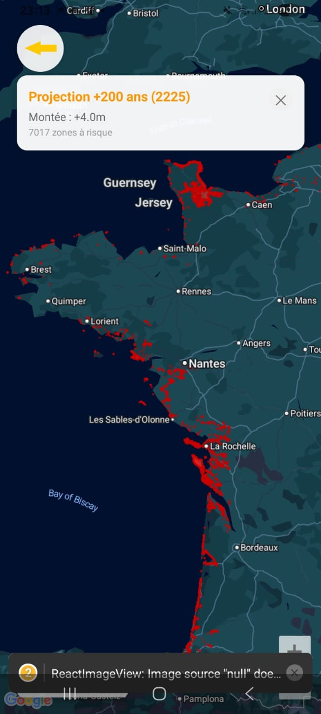

<div align="center">

# 🌊 SAUVETAROCHE

### Application mobile éducative sur l'érosion côtière

[](https://reactnative.dev/)
[](https://expo.dev/)
[](https://www.typescriptlang.org/)
[](https://opensource.org/licenses/MIT)
[](https://github.com)

**[Télécharger](#-installation)** • **[Documentation](https://drive.google.com/drive/u/2/folders/1-6Zyo5Eqjw6-DlHBN8UDSrhlZlRopb-F)** • **[Démo](#-captures-décran)** • **[Contribuer](#-contribution)**

---

</div>

##  Table des matières

- [À propos](#-à-propos)
- [Fonctionnalités principales](#-fonctionnalités-principales)
- [Captures d'écran](#-captures-décran)
- [Technologies utilisées](#-technologies-utilisées)
- [Prérequis](#-prérequis)
- [Installation](#-installation)
- [Configuration](#-configuration)
- [Structure du projet](#-structure-du-projet)
- [Données géographiques](#-données-géographiques)
- [Utilisation](#-utilisation)
- [Dépannage](#-dépannage)
- [Contribution](#-contribution)
- [Équipe](#-équipe)
- [Licence](#-licence)
- [Remerciements](#-remerciements)

---

##  À propos

**SAUVETAROCHE** est une application mobile interactive développée pour sensibiliser le grand public aux enjeux de **l'érosion côtière** et de la **montée des eaux** liée au changement climatique.

À travers un **jeu décisionnel**, des **défis quotidiens** et des **cartes prévisionnelles**, l'utilisateur découvre l'impact concret de ces phénomènes sur les zones côtières françaises, avec des données scientifiques réelles du **BRGM** (Bureau de Recherches Géologiques et Minières).

###  Objectifs pédagogiques

-  **Sensibiliser** aux conséquences du changement climatique sur le littoral
-  **Apprendre** par le jeu, défi et la simulation
-  **Visualiser** les projections à 50, 100 et 200 ans
-  **Comprendre** l'importance des décisions politiques et environnementales

---

##  Fonctionnalités principales

###  Mode Jeu

- **Jeu décisionnel interactif** où vous incarnez un gestionnaire de circonscription
- **Deux niveaux de difficulté** (Niveau 2 en développement)
- **Système de décisions** impactant votre territoire et la satisfaction citoyenne
- **Carte dynamique** montrant l'évolution de votre zone en temps réel
- **Jauge de satisfaction** pour mesurer l'acceptabilité de vos choix et le ressenti de la population que vous administrez
- **Questions-réponses** avec explications scientifiques après chaque décision

###  Défis quotidiens

- **Quiz thématiques** sur l'érosion côtière et le changement climatique aisin que les politiques associées
- **4 réponses possibles** avec correction
- **Feedback immédiat** : victoire ou défaite avec explications
- **Questions basées sur des données réelles**

###  Données prévisionnelles

Visualisez l'impact de la montée des eaux avec **4 cartes interactives** :

| Projection | Élévation | Année |
|-----------|-----------|-------|
| **Actuel** | Niveau actuel | 2024 |
| **+50 ans** | +0.5m | 2075 |
| **+100 ans** | +1.5m | 2125 |
| **+200 ans** | +4.0m | 2225 |

- **Données BRGM officielles** pour toute la France métropolitaine
- **Zones inondables** affichées en superposition sur Google Maps/Apple Maps
- **Navigation interactive** : zoomez, déplacez-vous sur la carte
- **Polygones cliquables** avec informations détaillées

---

##  Captures d'écran

<p align="center">
  
</p>
<p align="center"><em>Page d'accueil avec les 3 modules principaux</em></p>

<br>

<p align="center">
  
</p>
<p align="center"><em>Mode Jeu : carte dynamique et système de décisions</em></p>

<br>

###  Module Défis

<p align="center">
  
  &nbsp;&nbsp;
  
  &nbsp;&nbsp;
  
</p>
<p align="center"><em>Quiz interactif avec feedback immédiat</em></p>

<br>

###  Module Données

<p align="center">
  
  &nbsp;&nbsp;
  
  &nbsp;&nbsp;
  
</p>
<p align="center"><em>Cartes prévisionnelles avec zones inondables (bleu : +50 ans, orange : +100 ans, rouge : +200 ans)</em></p>

---

##  Technologies utilisées

### Frontend
- **React Native 0.74** - Framework mobile cross-platform
- **TypeScript** - Typage statique pour JavaScript
- **Expo SDK** - Outils de développement et build (générer un fichier .apk ou .ipa
- **React Navigation** - Navigation entre écrans

### Cartographie
- **react-native-maps** - Intégration de cartes natives
- **Google Maps SDK** (Android) - Affichage des cartes sur Android
- **Apple Maps** (iOS) - Affichage des cartes sur iOS

### Données géographiques
- **QGIS** - Traitement des données géospatiales du BRGM
- **Mapshaper** - Simplification des fichiers GeoJSON
- **BRGM Shapefiles** - Données officielles des zones inondables

### Développement
- **Visual Studio Code** - IDE principal
- **Android Studio** - Émulateur Android et SDK
- **Xcode** (macOS uniquement) - Émulateur iOS
- **Node.js** - Environnement d'exécution JavaScript
- **npm** - Gestionnaire de paquets

---

##  Prérequis

Avant de commencer, assurez-vous d'avoir installé :

### Logiciels requis

| Logiciel | Version minimale | Lien de téléchargement |
|----------|------------------|------------------------|
| **Node.js** | ≥ 18.0.0 | [nodejs.org](https://nodejs.org/) |
| **npm** | ≥ 9.0.0 | Inclus avec Node.js |
| **Git** | Dernière version | [git-scm.com](https://git-scm.com/) |
| **Android Studio** | Dernière version | [developer.android.com](https://developer.android.com/studio) |
| **Xcode** (macOS) | ≥ 14.0 | Mac App Store |

### Configuration système recommandée

- **RAM** : 8 GB minimum (16 GB recommandé)
- **Stockage** : 10 GB d'espace libre
- **OS** : Windows 10/11, macOS 12+, ou Linux (Ubuntu 20.04+)

### Comptes nécessaires

- **Compte Google Cloud** (gratuit) pour obtenir une clé API Google Maps

---

##  Installation

### Étape 1 : Cloner le projet

```bash
# Cloner le dépôt GitHub
git clone https://github.com/votre-username/SauveTaRoche.git

# Entrer dans le dossier du projet
cd SauveTaRoche/App
```

### Étape 2 : Installer les dépendances

```bash
# Installer tous les packages npm
npm install

# Ou avec Yarn
yarn install
```

⏱️ **Temps estimé** : 2-5 minutes selon votre connexion internet

### Étape 3 : Vérifier l'installation

```bash
# Vérifier que Node.js est installé
node --version
# Devrait afficher v18.x.x ou supérieur

# Vérifier que npm est installé
npm --version
# Devrait afficher v9.x.x ou supérieur
```

---

## ⚙️ Configuration

### Configuration de Google Maps API

#### 1. Obtenir une clé API Google Maps

1. Allez sur [Google Cloud Console](https://console.cloud.google.com/)
2. Créez un nouveau projet ou sélectionnez un projet existant
3. Activez les APIs suivantes :
   - **Maps SDK for Android**
   - **Maps SDK for iOS** (si vous développez pour iOS)
4. Créez une clé API dans **APIs & Services** → **Credentials**
5. Copiez votre clé API

#### 2. Configurer pour Android

Ouvrez `android/app/src/main/AndroidManifest.xml` et ajoutez :

```xml
<application>
  <!-- Ajoutez cette ligne avec VOTRE clé API -->
  <meta-data
    android:name="com.google.android.geo.API_KEY"
    android:value="VOTRE_CLE_API_GOOGLE_MAPS"/>
</application>
```

#### 3. Configurer pour iOS (macOS uniquement)

Ouvrez `ios/YourApp/AppDelegate.mm` et ajoutez :

```objc
#import <GoogleMaps/GoogleMaps.h>

- (BOOL)application:(UIApplication *)application didFinishLaunchingWithOptions:(NSDictionary *)launchOptions
{
  [GMSServices provideAPIKey:@"VOTRE_CLE_API_GOOGLE_MAPS"];
  // ... reste du code
}
```

⚠️ **Important** : Ne commitez jamais votre clé API sur GitHub ! Utilisez des variables d'environnement en production.

---

## 🚀 Lancement de l'application

### Sur Android (Émulateur)

```bash
# Option 1 : Via Expo (développement)
npx expo start

# Puis appuyez sur 'a' dans le terminal pour lancer sur Android

# Option 2 : Build natif (production)
npx expo run:android
```

### Sur iOS (macOS uniquement)

```bash
# Via Expo
npx expo start

# Puis appuyez sur 'i' dans le terminal pour lancer sur iOS

# Ou build natif
npx expo run:ios
```

### Sur un appareil physique

1. Installez **Expo Go** depuis :
   - [Google Play Store](https://play.google.com/store/apps/details?id=host.exp.exponent) (Android)
   - [App Store](https://apps.apple.com/app/expo-go/id982107779) (iOS)

2. Lancez l'application :
```bash
npx expo start
```

3. Scannez le QR code qui s'affiche dans le terminal :
   - **Android** : Avec l'application Expo Go
   - **iOS** : Avec l'appareil photo natif

---

## 📂 Structure du projet

```
SauveTaRoche/
├── App/                          # Dossier principal de l'application
│   ├── activities/               # Écrans de l'application
│   │   ├── CurrentDataActivity.tsx    # Carte actuelle
│   │   ├── Data50Activity.tsx         # Projection +50 ans
│   │   ├── Data100Activity.tsx        # Projection +100 ans
│   │   ├── Data200Activity.tsx        # Projection +200 ans
│   │   ├── GameL1Activity.tsx         # Jeu niveau 1
│   │   ├── GameL2Activity.tsx         # Jeu niveau 2
│   │   ├── ChallengeActivity.tsx      # Module défis
│   │   └── ...
│   ├── data/                     # Données géographiques
│   │   ├── floodZones50.js/      # Zones inondables +50 ans
│   │   │   
│   │   ├── floodZones100.js/     # Zones inondables +100 ans
│   │   │   
│   │   └── floodZones200.js/     # Zones inondables +200 ans
│   │      
│   ├── model/                    # Logique métier
│   │   ├── GameUI.ts            # Composants du jeu
│   │   ├──Audiocontext.tsx      # Pour pouvoir ajouter le son au jeu
│   │   ├── GameQuestions.ts      # Questions du jeu
│   │   └── GameQuestionsRepository.ts
│   ├── assets/                   # Ressources (images, polices, sons)
│   │   ├── images/
│   │   ├── fonts/
│   │   └── *.mp3
│   ├── App.tsx                   # Point d'entrée de l'application
│   ├── app.json                  # Configuration Expo
│   ├── package.json              # Dépendances npm
│   ├── tsconfig.json             # Configuration TypeScript
│   └── metro.config.js           # Configuration Metro bundler
├── README.md                     # Ce fichier
└── .gitignore                    # Fichiers à ignorer par Git
```

---

##  Données géographiques

### Source des données

Les **zones inondables** affichées dans l'application proviennent du **BRGM** (Bureau de Recherches Géologiques et Minières), organisme public français de référence sur les géosciences.

### Traitement des données

1. **Téléchargement** : Shapefiles officiels du BRGM pour 3 scénarios (+0.5m, +1.5m, +4m)
2. **Reprojection** : Conversion en WGS84 (EPSG:4326) via QGIS
3. **Simplification** : Réduction de la complexité à 0.03-0.1% via Mapshaper
4. **Découpage** : Division en fichiers de < 3 MB pour optimiser les performances
5. **Conversion** : Transformation en format JavaScript pour React Native

### Précision et limites

- ✅ **Données officielles** validées scientifiquement
- ✅ **Couverture** : France métropolitaine complète
- ⚠️ **Simplification** : Les contours peuvent être légèrement approximatifs
- ⚠️ **Projections** : Basées sur des modèles climatiques (incertitudes inhérentes)

---

##  Utilisation

### Navigation dans l'application

1. **Page d'accueil** : Choisissez entre Jeu, Défis ou Données
2. **Bouton retour** (flèche) : Toujours en haut à gauche pour revenir

### Mode Jeu

1. Lisez la question posée par le personnage
2. Choisissez une des 4 réponses
3. Observez l'impact sur la carte et la jauge de satisfaction
4. Lisez l'explication scientifique
5. Continuez jusqu'à la fin de la partie

**Objectif** : Maintenir une satisfaction > 50% jusqu'à la fin du jeu afin de consolider sa place

### Défis

1. Lisez la question affichée
2. Sélectionnez votre réponse parmi les 4 choix
3. Découvrez si vous avez gagné ou perdu
4. Apprenez grâce à la correction détaillée

### Données

1. Sélectionnez un onglet temporel (Actuel, +50 ans, +100 ans, +200 ans)
2. Naviguez sur la carte :
   - **Zoom** : Pincement à deux doigts
   - **Déplacement** : Glisser le doigt
3. Cliquez sur une zone bleue/orange/rouge pour plus d'informations
4. Fermez/ouvrez la bannière d'information avec le bouton ✕ ou ℹ️

---

##  Dépannage

### Problème : L'application ne se lance pas

**Solution** :
```bash
# Nettoyer le cache
watchman watch-del-all
rm -rf node_modules
npm install

# Nettoyer le cache Metro
npx expo start --clear
```

### Problème : Erreur "Google Maps API key not found"

**Solution** :
1. Vérifiez que vous avez bien ajouté la clé dans `AndroidManifest.xml` ou `AppDelegate.mm`
2. Vérifiez que les APIs sont activées sur Google Cloud Console
3. Rebuild l'application : `npx expo run:android ou npx eas build --profile-development`

### Problème : La carte affiche toute la Terre en bleu

**Cause** : Coordonnées en mauvais système de projection (Lambert 93 au lieu de WGS84)

**Solution** : Vérifiez que vos fichiers `floodZones*.js` contiennent des coordonnées du type :
```javascript
latitude: 48.4084,  // Correct
longitude: -4.6147  // Correct

// Et PAS :
latitude: 6179406.5  // ❌ Mauvais système
```

### Problème : "Text strings must be rendered within a <Text> component"

**Cause** : Commentaire `//` mal placé dans le JSX

**Solution** : Remplacez les commentaires `//` par `{/* */}` dans le code JSX

### Problème : L'app crashe au chargement des données

**Cause** : Fichiers GeoJSON trop volumineux (> 5 MB)

**Solution** : Simplifiez davantage sur Mapshaper avec `simplify 0.03% keep-shapes`

### Problème : Erreur "Metro bundler timeout"

**Solution** :
```bash
# Augmenter le timeout dans metro.config.js
# Voir section Configuration
```

---

##  Contribution

Les contributions sont les bienvenues ! Voici comment participer :

### 1. Fork le projet

Cliquez sur le bouton "Fork" en haut à droite de la page GitHub.

### 2. Créer une branche

```bash
git checkout -b feature/amelioration-xyz
```

### 3. Commit vos changements

```bash
git commit -m "Ajout de la fonctionnalité XYZ"
```

### 4. Push vers la branche

```bash
git push origin feature/amelioration-xyz
```

### 5. Ouvrir une Pull Request

Décrivez vos changements en détail dans la Pull Request.

### Guidelines

- ✅ Testez votre code avant de commit
- ✅ Suivez les conventions de nommage existantes
- ✅ Commentez le code complexe
- ✅ Mettez à jour la documentation si nécessaire

---

## 👥 Équipe

Ce projet a été développé par l'**équipe CAILLOUX** dans le cadre d'un projet pédagogique :

| Membre | Rôle | Contact |
|--------|------|---------|
| **Pako Justin** | Développeur Full-Stack | [GitHub](https://github.com/Pakoooooooooo) |
| **Jamgotchian Clémence** |  Designer UX/UI| [GitHub](https://github.com/cj542) |
| **Berry Coline** | Designer UX/UI | [GitHub](https://github.com/berrycoline) |
| **Kouassi Emmanuel** | Développeur Back-End / Données | [GitHub](https://github.com/Rachidjunior) |
| **Guillot Flavien** | Développeur Back-End / Son | [GitHub](https://github.com/flan44) |

---

##  Licence

Ce projet est sous licence **MIT** - voir le fichier [LICENSE](LICENSE) pour plus de détails.

Cela signifie que vous êtes libre de :
- ✅ Utiliser le code pour des projets personnels ou commerciaux
- ✅ Modifier le code selon vos besoins
- ✅ Distribuer le code
- ✅ Utiliser le code dans des projets privés

Sous conditions de :
- ⚠️ Conserver la notice de copyright
- ⚠️ Inclure une copie de la licence MIT

---

##  Remerciements

Nous tenons à remercier chaleureusement :

### Institutions et organisations

- **BRGM** (Bureau de Recherches Géologiques et Minières) pour les données géospatiales officielles
- **IMT Atlantique** pour l'encadrement du projet
- **Google** pour l'API Google Maps
- **Expo** pour les outils de développement mobile

### Encadrants et participants

- Tous nos **encadrants** pour leurs conseils, suivi et leur soutien
- Les **participants aux enquêtes de terrain** qui ont permis de comprendre la problématique de l'érosion du trait de cote et ainsi developper une solution pertinente 
- La communauté **React Native** pour la documentation et les ressources

### Outils open-source

- **QGIS** - Traitement des données géographiques
- **Mapshaper** - Simplification des fichiers GeoJSON
- **React Native** et son écosystème
- **brgm.org** - Données cartographiques libres

---

##  Contact & Documentation

###  Documentation complète

Accédez à notre documentation détaillée (User Stories, Personas, Enquêtes de terrain, Blog, État de l'art) :

🔗 **[Documentation Google Drive](https://drive.google.com/drive/u/2/folders/1-6Zyo5Eqjw6-DlHBN8UDSrhlZlRopb-F)**

###  Signaler un bug

Ouvrez une [Issue sur GitHub](https://github.com/Pakoooooooooo/SauveTaRoche/issues) en décrivant :
- Le comportement observé
- Le comportement attendu
- Les étapes pour reproduire le bug
- Votre environnement (OS, version de Node.js, etc.)

###  Nous contacter

- **Email** : emmanuelrjkouassi1908@example.com
- **GitHub** : https://github.com/Pakoooooooooo/SauveTaRoche

---

##  Roadmap

### ✅ Version 1.0 (Actuelle)

- [x] Jeu niveau 1 complet
- [x] Module Défis
- [x] Cartes prévisionnelles (Actuel, +50, +100, +200 ans)
- [x] Données BRGM pour toute la France

### 🚧 Version 2.0 (Futur)

- [ ] Jeu niveau 2 (complexité augmentée)
- [ ] Sauvegarde de la progression
- [ ] Nouveaux défis quotidiens
- [ ] Ajout de nouvelles régions côtières (DOM-TOM)
- [ ] Animations 3D des montées des eaux
- [ ] Notifications push pour les défis

---

<div align="center">

## ❤️ Développé avec passion par l'équipe CAILLOUX

**Pour un avenir plus conscient des enjeux climatiques**

---

<p>
  <a href="#-sauvetaroche">Retour en haut ⬆️</a>
</p>

</div>
